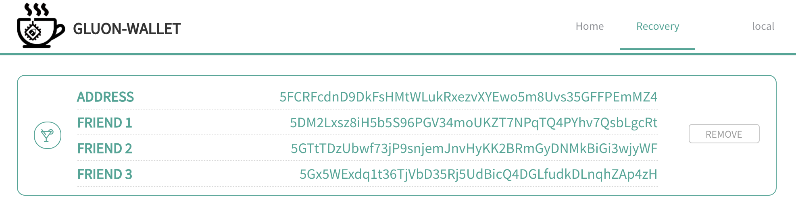
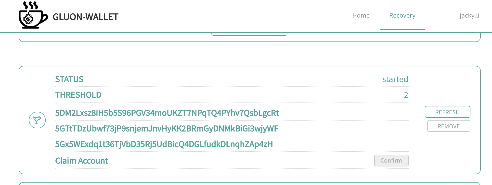
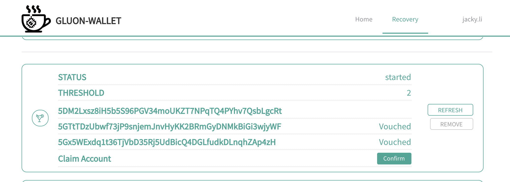
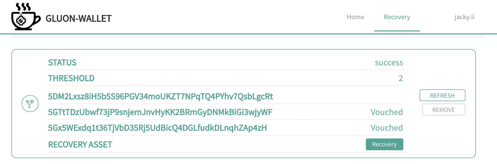
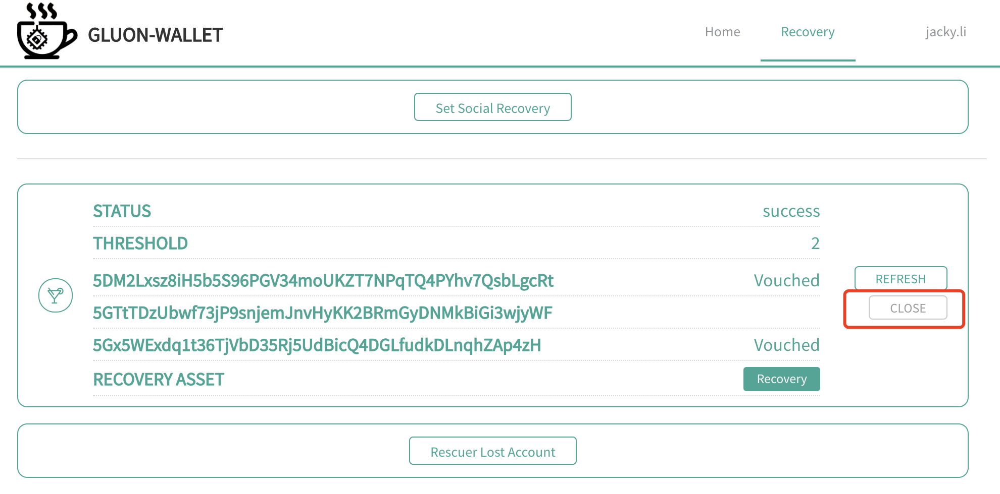
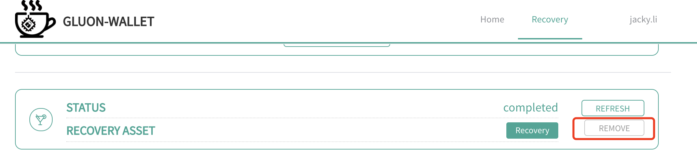
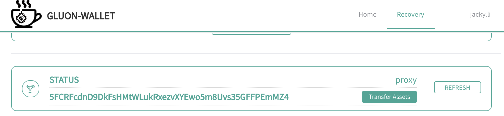

# Milestone2

## Milestone说明
- 因为还在开发阶段，Layer2还没有开发完成，所有依赖layer2的部分都是mock的，等待layer2完成以后再对接。
- 提供了一个测试的asset类型XYZ，等layer2完成以后会先提供DOT，BTC，ETH这三个主链的asset。


## 本地运行
```
docker-compose up -d
```
Open webapp with http://127.0.0.1:3000/

## 测试流程

### 准备账号
需要准备5个插件的地址
- A：原地址
- B，C，D：做为Social Recovery的朋友地址
- E：用来recovery A地址的新地址

### A地址添加测试asset
- A地址充值token
- 在Home页点击"Add Test Asset", 随便输入一个标识，会在A地址下生成一个测试XYZ asset.
- 注意此交易只是用来测试的，可以随便输入，没有实际作用，以后asset会从layer2产生。
- 此时A地址同时拥有token和测试asset.

### A地址设置Social Recovery
- A地址在Recovery页面，点击"Set Socail Recovery".
- 输入B，C，D，做为朋友地址，当前测试的配置是3个朋友有2个vouch了就可以恢复。



### 假设A地址密钥丢失，开始recovery
- 切换到E地址，充值，开始Recovery流程.
- 在Recovery页面，点击"Rescuer Lost Account".
- 输入A地址.


### B，C地址做为朋友进行vouch操作
- 切换到B地址，充值.
- 进入Recovery页面，点击"Vouch For Friend".
- 分别输入A地址做为丢失地址，E地址做为找回地址.

- 切换到C地址，重复以上操作

- 操作完成后，切换到E地址，可以看到当前的recovery状态



### 取回A地址的控制权
- 等待Recovery锁定时间到期，目前设置为100个区块，大约600秒.
- 点击Cliam Account右侧的"confirm"
- 操作成功会看到如下显示



### 取回原地址的Asset
- 点击 Recovery 按钮
- 此时A地址的所有token和asset已经转移到E地址上了，可以切换回A地址检验

### 关闭当前recovery的活动


- 点击图上的"CLOSE"，可以关闭当前的Recovery活动.

### 删除recovery配置



- 点击图上的"REMOVE"，可以删除A地址设置的Recovery配置，并拿回所有的deposit.
- 删除以后E地址仍然保有A地址的代理权，可以对A地址做转移资产的操作.

- 当前版本不提供E地址去除A地址代理权的操作，未来可能会有。



-----------------
以上是Social Recovery的测试流程，目前不涉及到mobile app.

