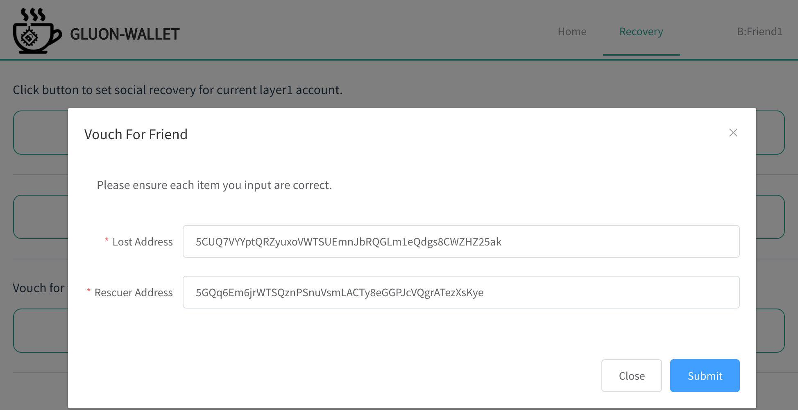

# Milestone2

## Run in local
```
docker-compose up -d
```
Open webapp with http://127.0.0.1:3000/

## Preparations
Key feature: Recovery To a New Address    
## Video Walkthrough:    
[](https://www.youtube.com/watch?v=lUtS9-FF_UE&t=2s)

### 5 Accounts Needed for Demo:
- A：Lost Device Account
- B，C，D：Recovery "Friends"' Accounts
- E：New Device Account

### Add a Test Asset at Address A
1. Change account to A in the profile tab.

2. Top Up


3. Navigate to Home Tab and click "Add Test Asset"

4. When prompted, input a label of your preference. This creates a XYZ asset at address A.

5. Now there is both an XYZ asset and a Token at address A.


### Setting up Social Recovery at address A
1. Login to account A.

2. Navigate to the recovery tab and click "Set Social Recovery".

3. Set "Friends" addresses B，C，D，for recovery.


4. Currently, 2 out of 3 friends are required for successful recovery authentication.


### Recovery Process
1. Navigate to profile tab and set account to "E".
2. Top up: now we initiate the recovery process.

3. Navigate to the "Recovery" tab and click "Rescue Lost Account".

4. Enter Address of account "A". Note that if address A is lost, recovery is not possible.

5. Recovery is successfully created.


### Vouching for recovery from trusted accounts
1. Navigate to "Profile" tab and set account to "B".
2. Navigate to the "Recovery" tab，and click "Vouch For Friend".

3. Enter address "A" as "Lost Address" and "E" as "Rescuer Address"


4. Repeat this process with account "C"
5. Now, navigate back to account "E". The status should be identical to that of the screenshot below


### Restoration of control
- Recovery lock set at 100 blocks, taking roughly 600 seconds.
- Click the "Confirm" button in the "Claim Account" field.

- A successful claim should result in the following state:


### Transferring assets from Lost Account
- Click the "Recovery" button.

- The token and asset are transferred from account A to E.


### Close Recovery


- Once successfully recovered, the recovery can be closed. Click the "CLOSE" button in the screenshot above.

### Remove Past Recovery Activity


- Click the "REMOVE" button as indicated above，deletes the successful recovery activity and reimburses deposits to account A.
- Control over account A is retained.
- Transfer the reimbursement to E by clicking the "Transfer Assets" button.


------------
## Workflow description
#### Set social recovery (M2)

- Set social recovery tx
The tx name is **create_recovery** with [source-code](https://github.com/tearust/tea-layer1/blob/milestone-2/pallets/recovery/src/lib.rs)

- Start recovery process tx
The tx name is **initiate_recovery** with [source-code](https://github.com/tearust/tea-layer1/blob/milestone-2/pallets/recovery/src/lib.rs)

- Vouch for friend
The tx name is **vouch_recovery** with [source-code](https://github.com/tearust/tea-layer1/blob/milestone-2/pallets/recovery/src/lib.rs)

- Claim recovery tx
The tx name is **claim_recovery** with [source-code](https://github.com/tearust/tea-layer1/blob/milestone-2/pallets/recovery/src/lib.rs)

- Close recovery process tx
The tx name is **close_recovery** with [source-code](https://github.com/tearust/tea-layer1/blob/milestone-2/pallets/recovery/src/lib.rs)

- Remover recovery configuration tx
The tx name is **remove_recovery** with [source-code](https://github.com/tearust/tea-layer1/blob/milestone-2/pallets/recovery/src/lib.rs)

- Add test XYZ asset
The tx name is **test_add_account_asset** with [source-code](https://github.com/tearust/gluon-pallet/blob/milestone-2/gluon/src/lib.rs)

- Transfer asset to another address tx
The tx name is **test_transfer_all_asset** with [source-code](https://github.com/tearust/gluon-pallet/blob/milestone-2/gluon/src/lib.rs)
